# Build-Graphs Pipeline: End-to-End Flow

This document provides a detailed mermaid diagram of the complete "build-graphs" command pipeline in the gaze-guided scene graph system.

```mermaid
flowchart TD
    %% Entry Point
    A["`**main.py**
    build-graphs command`"] --> B["`**graph_processor.py**
    build_graphs()`"]
    
    %% Configuration and Setup
    B --> C["`**Configuration Loading**
    • Load video splits (train/val)
    • Filter videos if specified
    • Setup multiprocessing
    • Initialize GPU/CPU workers`"]
    
    %% Parallel Processing Setup
    C --> D["`**Multiprocessing Setup**
    • ProcessPoolExecutor
    • Worker assignment
    • CUDA device distribution`"]
    
    D --> E["`**For Each Video**
    process_video_worker()`"]
    
    %% Individual Video Processing
    E --> F["`**GraphBuilder Initialization**
    • Load config & split
    • Initialize tracer (optional)
    • Set YOLO model path`"]
    
    F --> G["`**Video Loading**
    Video class initialization`"]
    
    %% Video Processing Components
    G --> H["`**Video Components Setup**
    • VideoReader (torchvision)
    • Raw gaze data loading
    • Action records loading
    • Frame range determination`"]
    
    H --> I["`**Gaze Processing Setup**
    GazeProcessor initialization`"]
    
    %% Gaze Processing Details
    I --> J["`**Gaze Data Preprocessing**
    • Spatial stability analysis
    • Saccade reclassification
    • UNKNOWN interpolation
    • Noise filtering`"]
    
    J --> K["`**Component Initialization**
    _initialize_components()`"]
    
    %% Core Components
    K --> L["`**Object Detector Setup**
    • YOLO-World model loading
    • Class names (noun labels)
    • Confidence/IoU thresholds
    • Backend selection (ONNX/Ultralytics)`"]
    
    K --> M["`**Scene Graph Creation**
    Graph() with root node`"]
    
    K --> N["`**Checkpoint Manager**
    For saving graph states`"]
    
    K --> O["`**Graph Tracer**
    For visualization (optional)`"]
    
    %% Frame Processing Loop
    L --> P["`**Frame-by-Frame Processing**
    _process_video_frames()`"]
    M --> P
    N --> P
    O --> P
    
    P --> Q["`**Video Iterator**
    for frame, pts, is_black, gaze_point`"]
    
    Q --> R["`**Gaze Point Processing**
    GazeProcessor.__next__()`"]
    
    %% Gaze Classification
    R --> S["`**Gaze Classification**
    • Raw type from dataset
    • Spatial stability check
    • Consecutive fixation counting
    • Lookahead validation`"]
    
    S --> T{"`**Gaze Type?**`"}
    
    %% Frame Processing Branches
    T -->|Fixation| U["`**Fixation Handling**
    _handle_fixation()`"]
    T -->|Saccade| V["`**Saccade Handling**
    _handle_saccade()`"]
    T -->|Other| W["`**Skip Processing**
    Continue to next frame`"]
    
    %% Fixation Processing
    U --> X["`**Object Detection**
    ObjectDetector.detect_objects()`"]
    
    X --> Y["`**YOLO-World Inference**
    • Frame preprocessing
    • Text embedding generation
    • Model inference
    • NMS filtering`"]
    
    Y --> Z["`**Fixation Analysis**
    • Gaze-bbox intersection
    • Stability scoring
    • Confidence weighting
    • Duration analysis`"]
    
    Z --> AA["`**Fixated Object Selection**
    • Component score calculation
    • Top-scoring object selection
    • Visit record creation`"]
    
    %% Saccade Processing
    V --> BB["`**End Fixation**
    • Finalize visit record
    • Calculate fixated object
    • Update graph structure`"]
    
    AA --> CC["`**Visit Tracking**
    • Start/end frame recording
    • Object accumulation
    • State management`"]
    
    BB --> DD["`**Graph Update**
    scene_graph.update()`"]
    
    %% Graph Construction
    DD --> EE["`**Node Management**
    • Find/create matching node
    • Update visit records
    • Node feature extraction`"]
    
    EE --> FF["`**Edge Creation**
    • Spatial relationship calculation
    • Angle computation (8-bin)
    • Bidirectional edge addition`"]
    
    FF --> GG["`**Graph State Update**
    • Current node tracking
    • Adjacency list update
    • Tracer logging`"]
    
    %% Checkpointing
    CC --> HH["`**Checkpoint Creation**
    checkpoint_if_needed()`"]
    GG --> HH
    
    HH --> II["`**State Serialization**
    • Node data extraction
    • Edge data extraction
    • Adjacency serialization`"]
    
    II --> JJ["`**Checkpoint Storage**
    • Frame-based checkpointing
    • State change detection
    • Memory management`"]
    
    %% Tracing (Optional)
    X --> KK["`**Event Tracing**
    (if enabled)`"]
    DD --> KK
    FF --> KK
    
    KK --> LL["`**Trace Logging**
    • Frame events
    • Object detections
    • Node/edge additions
    • JSONL format`"]
    
    %% Loop Control
    W --> MM{"`**More Frames?**`"}
    CC --> MM
    JJ --> MM
    LL --> MM
    
    MM -->|Yes| Q
    MM -->|No| NN["`**Finalization**
    _finish_final_fixation()`"]
    
    %% Final Processing
    NN --> OO["`**Final Checkpoint Save**
    checkpoint_manager.save_checkpoints()`"]
    
    OO --> PP["`**Graph Serialization**
    • Context extraction
    • Portable format creation
    • PyTorch tensor saving`"]
    
    PP --> QQ["`**Output Generation**
    • Checkpoint file (.pth)
    • Trace file (.jsonl)
    • Processing logs`"]
    
    %% Parallel Completion
    QQ --> RR["`**Worker Completion**
    Return saved paths`"]
    
    RR --> SS["`**Result Aggregation**
    ProcessPoolExecutor completion`"]
    
    SS --> TT["`**Final Summary**
    • Total checkpoints created
    • Processing statistics
    • Output locations`"]
    
    %% Styling
    classDef entryPoint fill:#e1f5fe
    classDef processing fill:#f3e5f5
    classDef gaze fill:#e8f5e8
    classDef detection fill:#fff3e0
    classDef graphConstruction fill:#fce4ec
    classDef storage fill:#f1f8e9
    classDef decision fill:#fff8e1
    
    class A entryPoint
    class B,C,D,E,F processing
    class G,H,I,J,R,S gaze
    class L,X,Y,Z,AA detection
    class M,DD,EE,FF,GG graphConstruction
    class N,HH,II,JJ,OO,PP,QQ storage
    class T,MM decision
```

## Key Components Breakdown

### 1. **Entry & Configuration**
- Command parsing and validation
- Video split loading and filtering
- Multiprocessing setup with GPU distribution

### 2. **Video Processing Setup**
- Video file loading with torchvision
- Gaze data parsing and preprocessing
- Action annotation frame range determination

### 3. **Gaze Processing Pipeline**
- **Raw Data**: X,Y coordinates + type classification
- **Preprocessing**: Spatial stability analysis, noise filtering
- **Classification**: Fixation vs saccade determination
- **Validation**: Consecutive fixation counting, lookahead checks

### 4. **Object Detection Pipeline**
- **YOLO-World Model**: Text-prompted object detection
- **Inference**: Frame preprocessing, embedding generation, NMS
- **Fixation Analysis**: Gaze-bbox intersection, stability scoring
- **Selection**: Multi-component scoring for fixated objects

### 5. **Graph Construction**
- **Nodes**: Objects with visit records and features
- **Edges**: Spatial relationships with angular features
- **Updates**: Dynamic graph modification during processing

### 6. **State Management**
- **Checkpointing**: Frame-based graph state snapshots
- **Tracing**: Event logging for visualization
- **Serialization**: Portable format for training/analysis

### 7. **Parallel Processing**
- **Workers**: Multi-GPU/CPU video processing
- **Coordination**: Result aggregation and error handling
- **Output**: Checkpoint files and processing statistics

## Data Flow Summary

1. **Input**: Video files + gaze data + action annotations
2. **Processing**: Frame-by-frame gaze classification and object detection
3. **Construction**: Dynamic scene graph building with spatial relationships
4. **Output**: Graph checkpoints + optional trace files for visualization

The pipeline efficiently processes multiple videos in parallel while maintaining detailed state tracking and optional visualization support through comprehensive event tracing. 