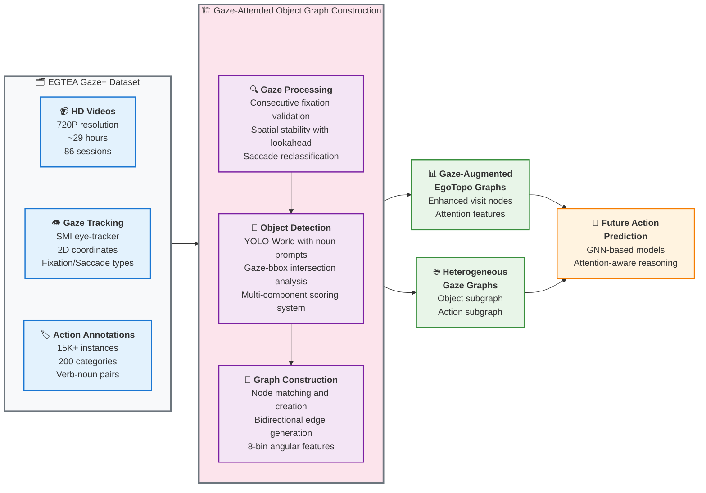

# Graph Construction Pipeline: System Overview

This diagram presents the high-level architecture of the gaze-guided scene graph construction system, suitable for poster presentation and academic papers.

## Key System Components

### 📥 **EGTEA Gaze+ Dataset**
- **HD Videos**: 720P resolution, ~29 hours from 86 sessions of 32 subjects
- **Gaze Tracking**: SMI eye-tracker with 2D coordinates and fixation/saccade types
- **Action Annotations**: 15K+ instances across 200 categories with verb-noun structure

### ⚙️ **Object Graph Construction Pipeline**

#### 1. **Gaze Processing**
- Consecutive fixation validation with configurable threshold (default: 5 frames)
- Spatial stability analysis using sliding window and distance thresholds
- Saccade reclassification to fixations based on spatial consistency and lookahead

#### 2. **Object Detection**
- YOLO-World inference with text prompts from action noun vocabulary
- Gaze-bbox intersection analysis with configurable margin for attention detection
- Multi-component scoring: confidence (geometric mean), stability (IoU), proximity (inverse distance), duration weighting

#### 3. **Graph Construction**
- Node matching by object label or dynamic creation with visit record tracking
- Bidirectional edge generation between consecutive nodes with spatial relationship encoding
- 8-bin angular features computed from gaze position transitions between fixations

### 🎯 **Output Representations**

#### **Gaze-Augmented EgoTopo Graphs**
- Enhanced visit nodes with gaze attention features
- Spatial-temporal structure preserving EgoTopo design
- Attention-weighted object representations

#### **Heterogeneous Gaze Graphs**
- **Object Subgraph**: Spatially-connected attended objects
- **Action Subgraph**: Temporally-linked past actions
- **Cross-Modal Edges**: Object-action attention links

### 🚀 **Applications**
- Future action prediction with attention-aware reasoning
- Structured representation learning for egocentric understanding
- Real-time assistive AI and AR applications

---

*This pipeline enables structured reasoning about human intentions by combining gaze attention with scene understanding, providing rich priors for egocentric action prediction tasks.* 