# Graph Construction Pipeline: System Overview

This diagram presents the high-level architecture of the gaze-guided scene graph construction system, suitable for poster presentation and academic papers.

```mermaid
flowchart LR
    %% Input Data
    A["`**Egocentric Video**
    RGB frames
    30 FPS`"] --> B["`**Gaze Data**
    Eye tracking
    Fixations/Saccades`"]
    
    B --> C["`**Action Labels**
    Temporal annotations
    Verb-noun pairs`"]
    
    %% Core Processing Pipeline
    C --> D["`**Gaze Processing**
    🔍 Fixation Detection
    📊 Stability Analysis
    🎯 Object Attention`"]
    
    D --> E["`**Object Detection**
    🤖 YOLO-World
    📝 Text Prompts
    🎯 Gaze-Object Matching`"]
    
    E --> F["`**Graph Construction**
    🔗 Node Creation
    📐 Spatial Relations
    ⏱️ Temporal Links`"]
    
    %% Output Representations
    F --> G["`**Gaze-Augmented
    EgoTopo Graphs**
    Enhanced visit nodes
    Attention features`"]
    
    F --> H["`**Heterogeneous
    Gaze Graphs**
    Object subgraph
    Action subgraph`"]
    
    %% Downstream Tasks
    G --> I["`**Future Action
    Prediction**
    GNN-based models
    Attention-aware reasoning`"]
    
    H --> I
    
    %% Styling for academic presentation
    classDef input fill:#e3f2fd,stroke:#1976d2,stroke-width:2px
    classDef processing fill:#f3e5f5,stroke:#7b1fa2,stroke-width:2px
    classDef output fill:#e8f5e8,stroke:#388e3c,stroke-width:2px
    classDef task fill:#fff3e0,stroke:#f57c00,stroke-width:2px
    
    class A,B,C input
    class D,E,F processing
    class G,H output
    class I task
```

## Key System Components

### 📥 **Input Modalities**
- **Egocentric Video**: First-person RGB video streams (30 FPS)
- **Gaze Data**: Eye tracking with fixation/saccade classification
- **Action Labels**: Temporal verb-noun annotations for supervision

### ⚙️ **Core Processing Pipeline**

#### 1. **Gaze Processing**
- Spatial stability analysis for robust fixation detection
- Temporal filtering to reduce noise and artifacts
- Attention mapping to identify object-focused gaze

#### 2. **Object Detection**
- YOLO-World with text prompt conditioning
- Gaze-guided object attention scoring
- Multi-frame consistency for stable detections

#### 3. **Graph Construction**
- Dynamic node creation for attended objects
- Spatial relationship encoding (8-directional bins)
- Temporal edge linking for action sequences

### 🎯 **Output Representations**

#### **Gaze-Augmented EgoTopo Graphs**
- Enhanced visit nodes with gaze attention features
- Spatial-temporal structure preserving EgoTopo design
- Attention-weighted object representations

#### **Heterogeneous Gaze Graphs**
- **Object Subgraph**: Spatially-connected attended objects
- **Action Subgraph**: Temporally-linked past actions
- **Cross-Modal Edges**: Object-action attention links

### 🚀 **Applications**
- Future action prediction with attention-aware reasoning
- Structured representation learning for egocentric understanding
- Real-time assistive AI and AR applications

---

*This pipeline enables structured reasoning about human intentions by combining gaze attention with scene understanding, providing rich priors for egocentric action prediction tasks.* 