# Graph Construction Pipeline: System Overview

This diagram presents the high-level architecture of the gaze-guided scene graph construction system, suitable for poster presentation and academic papers.

```mermaid
flowchart LR
    %% Dataset Container
    subgraph Dataset["🗂️ EGTEA Gaze+ Dataset"]
        direction TB
        A["`📹 **HD Videos**
        720P resolution
        ~29 hours total
        86 sessions`"]
        
        B["`👁️ **Gaze Tracking**
        SMI eye-tracker
        2D coordinates
        Fixation/Saccade`"]
        
        C["`🏷️ **Action Annotations**
        15K+ instances
        200 categories
        Verb-noun pairs`"]
        
        %% hide the edges while preserving the layout
        A ~~~ B
        B ~~~ C
    end
    
    %% Core Processing Pipeline
    subgraph Pipeline["🏗️ Gaze-Attended Object Graph Construction"]
        direction TB
        dummy(( )):::spacer

        D["`🔍 **Gaze Processing**
        Fixation smoothing
        Noise interpolation`"]
        
        E["`🤖 **Object Detection**
        YOLO-World noun prompts
        Gaze-BBox intersection
        Multi-component scoring`"]
        
        F["`🔗 **Graph Construction**
        Fixation-driven node creation
        Object-based node merging
        Temporal edge linking`"]
        
        dummy ~~~ D
        D --> E
        E --> F
    end
    
    Dataset --> Pipeline
    
    %% Output Representations
    Pipeline --> G["`📊 **Gaze-Augmented
    EgoTopo Graphs**
    Enhanced visit nodes
    Attention features`"]
    
    Pipeline --> H["`🌐 **Heterogeneous
    Gaze Graphs**
    Object subgraph
    Action subgraph`"]
    
    %% Downstream Tasks
    G --> I["`🚀 **Future Action
    Prediction**
    GNN-based models
    Attention-aware reasoning`"]
    
    H --> I
    
    %% Styling for academic presentation
    classDef spacer fill:transparent,stroke:transparent,stroke-width:0px
    classDef dataset fill:#f8f9fa,stroke:#6c757d,stroke-width:3px
    classDef pipeline fill:#fce4ec,stroke:#6c757d,stroke-width:3px
    classDef input fill:#e3f2fd,stroke:#1976d2,stroke-width:2px
    classDef processing fill:#f3e5f5,stroke:#7b1fa2,stroke-width:2px
    classDef output fill:#e8f5e8,stroke:#388e3c,stroke-width:2px
    classDef task fill:#fff3e0,stroke:#f57c00,stroke-width:2px
    
    class Dataset dataset
    class Pipeline pipeline
    class A,B,C input
    class D,E,F processing
    class G,H output
    class I task
```

## Key System Components

### 📥 **EGTEA Gaze+ Dataset**
- **HD Videos**: 720P resolution, ~29 hours from 86 sessions of 32 subjects
- **Gaze Tracking**: SMI eye-tracker with 2D coordinates and fixation/saccade types
- **Action Annotations**: 15K+ instances across 200 categories with verb-noun structure

### ⚙️ **Object Graph Construction Pipeline**

#### 1. **Gaze Processing**
- Fixation window filtering with minimum threshold (default: 4 frames)
- Noisy gaze point interpolation using neighbor distance (0.2 threshold)

#### 2. **Object Detection**
- YOLO-World inference (640px, conf=0.15, IoU=0.5) with noun vocabulary prompts
- Gaze-bbox intersection analysis with 10px margin expansion
- Multi-component scoring: confidence (geometric mean ≥0.3), bbox stability (IoU), gaze proximity, fixation ratio

#### 3. **Graph Construction**
- Node creation for new objects or visit updates for existing nodes with matching labels
- Bidirectional edge creation between consecutive fixated objects (except from root)
- Spatial relationship encoding: 8-bin angular features, gaze position transitions, distance

### 🎯 **Output Representations**

#### **Gaze-Augmented EgoTopo Graphs**
- Enhanced visit nodes with gaze attention features
- Spatial-temporal structure preserving EgoTopo design
- Attention-weighted object representations

#### **Heterogeneous Gaze Graphs**
- **Object Subgraph**: Spatially-connected attended objects
- **Action Subgraph**: Temporally-linked past actions
- **Cross-Modal Edges**: Object-action attention links

### 🚀 **Applications**
- Future action prediction with attention-aware reasoning
- Structured representation learning for egocentric understanding
- Real-time assistive AI and AR applications

---

*This pipeline enables structured reasoning about human intentions by combining gaze attention with scene understanding, providing rich priors for egocentric action prediction tasks.* 