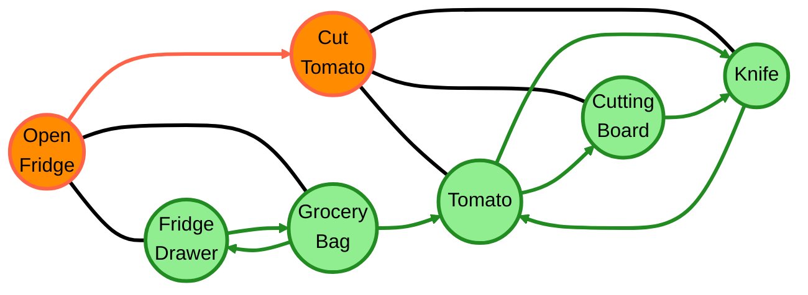

# Heterogeneous Graph - Horizontal Flowchart

This diagram represents a heterogeneous graph with activity and object nodes in separate grouped boxes.

## Features
- Horizontal layout with activity nodes on the left, object nodes on the right
- Larger round nodes for both activities and objects
- Undirected action-object (gaze) edges
- Loops between Grocery Bag ↔ Fridge Drawer and Tomato ↔ Knife
- Inverted Cutting Board → Knife direction
- Consistent edge styling with different colors for edge types
- Grouped nodes in dashed boxes for visual organization
- Clean edges without labels for better readability

## Edge Types Legend

- **Temporal edges** (orange): Connect activities in temporal sequence
- **Gaze edges** (black, undirected): Connect activities to objects that receive gaze attention
- **Relation edges** (green): Connect objects that have spatial or functional relationships

## Node Types

- **Activity nodes** (orange, round): Represent human activities with time duration in brackets, grouped in dashed box
- **Object nodes** (green, round): Represent physical objects in the environment, grouped in dashed box
